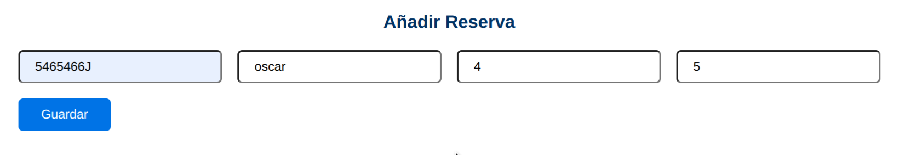

# ✈️ Agencia de Viajes – Sistema de Reservas

Este proyecto backend desarrollado en **Spring Boot** gestiona una **agencia de viajes** con funcionalidades **CRUD completas** para hoteles, vuelos y reservas, junto con una **interfaz web interactiva** integrada.

---

## ⚙️ Pasos para ejecutar el proyecto

1. 📂 **Crear la base de datos**  
   Ejecuta el script [creacion_db.sql](./creacion_db.sql) , pensado para MySQL.
   > Se crea la base de datos llamada agencia.

2. 🔧 **Configurar credenciales**  
   En `src/main/resources/application.properties` introduce tus credenciales:

   ```properties
   spring.datasource.username=TU_USUARIO
   spring.datasource.password=TU_CONTRASEÑA
   ```

3. 🚀 **Ejecutar la aplicación**  
Ejecuta la clase principal `ReservasApplication.java`. La interfaz web estará disponibles en:
- [http://localhost:8080/index.html](http://localhost:8080/index.html)
- [http://localhost:8080/hoteles.html](http://localhost:8080/hoteles.html)
- [http://localhost:8080/vuelos.html](http://localhost:8080/vuelos.html)
- [http://localhost:8080/reservas.html](http://localhost:8080/reservas.html)


4. 🧪 **Probar API con Postman (opcional)**  
Puedes probar los endpoints REST para hoteles, vuelos y reservas. Los datos iniciales se cargan automáticamente al iniciar.

---

## 📌 Tecnologías utilizadas

- Java 21
- Spring Boot
- Spring Data JPA
- MySQL
- Maven
- **Frontend:** HTML, CSS, JavaScript (Fetch API)

---

## 🗂 Estructura destacada del proyecto

```
reservas
├── creacion_db.sql               # Script para crear base de datos
├── src
│   ├── main
│   │   ├── java/com/agenciaviajes/reservas
│   │   │   ├── config/WebConfig.java           # Configuración Spring MVC
│   │   │   ├── controller/                      # Controladores REST
│   │   │   ├── init/DataInitializer.java       # Datos iniciales precargados
│   │   │   ├── model/                           # Entidades JPA
│   │   │   ├── repository/                      # Repositorios JPA
│   │   │   ├── service/                         # Servicios de negocio
│   │   │   └── ReservasApplication.java        # Clase principal
│   │   └── resources
│   │       ├── application.properties           # Configuración app
│   │       └── static                           # Interfaz web estática
│   │           ├── css/style.css
│   │           ├── js/                          # JavaScript para frontend
│   │           ├── index.html                   # Página principal
│   │           ├── hoteles.html
│   │           ├── vuelos.html
│   │           └── reservas.html
└── README.md
```

---

## 🧭 Endpoints disponibles (REST API)

| **Método** | **Endpoint**        | **Descripción**            |
|------------|---------------------|----------------------------|
| `GET`      | `/hoteles`          | Listar hoteles             |
| `POST`     | `/hoteles`          | Crear hotel                |
| `PUT`      | `/hoteles/{id}`     | Actualizar hotel           |
| `DELETE`   | `/hoteles/{id}`     | Eliminar hotel             |
| `GET`      | `/vuelos`           | Listar vuelos              |
| `POST`     | `/vuelos`           | Crear vuelo                |
| `PUT`      | `/vuelos/{id}`      | Actualizar vuelo           |
| `DELETE`   | `/vuelos/{id}`      | Eliminar vuelo             |
| `GET`      | `/reservas`         | Listar reservas            |
| `POST`     | `/reservas`         | Crear reserva              |
| `PUT`      | `/reservas/{id}`    | Actualizar reserva         |
| `DELETE`   | `/reservas/{id}`    | Eliminar reserva           |

---

## 📝 Ejemplo de uso

Crear reserva con Postman (API REST):

```json
{
  "dni": "12345678A",
  "usuario": "Laura Pérez",
  "vueloId": 1,
  "hotelId": 2
}
```

Crear reserva desde la interfaz web:

1. Accede a [Reservas](http://localhost:8080/reservas.html)
2. Completa el formulario con los datos necesarios
3. Envía el formulario (se comunicará con el backend vía `fetch`)
   

---

## 🧩 Lógica interna

Una reserva enlaza un **hotel** y un **vuelo**:

- ✅ Al crear la reserva:
    - Disminuye plazas disponibles del vuelo
    - Cambia disponibilidad del hotel a `false`
- ❌ Si el hotel no está disponible o no hay plazas, la API devuelve un error `400 Bad Request`

---

## 🧠 Autor

Desarrollado por **Óscar Fernández** – Proyecto educativo para **1ºDAM** 👨‍💻  
🔗 [GitHub](https://github.com/oscarfhdev)

## 📄 Licencia

Este proyecto está bajo **licencia MIT** – consulta el archivo `LICENSE` para más detalles.

