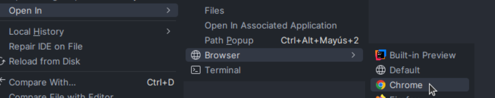

# ✈️ Agencia de Viajes – Sistema de Reservas

Este proyecto backend desarrollado en **Spring Boot** gestiona una **agencia de viajes** con funcionalidades **CRUD completas** para hoteles, vuelos y reservas, y ahora incluye una **interfaz web interactiva** para facilitar su uso.

---

## ⚠️ IMPORTANTE: Cómo probar la interfaz web correctamente

Para que la aplicación web funcione sin problemas (especialmente las llamadas `fetch` desde JavaScript al backend), **debes abrir los archivos `.html` desde IntelliJ IDEA usando la opción "Open in Browser"** (preferiblemente con **Google Chrome**).  

Abrir los archivos directamente desde el explorador sin este paso puede causar problemas con CORS y las peticiones no funcionarán.  

> En IntelliJ:  
> 1. Navega a `src/main/resources/interface/index.html`  
> 2. Haz clic derecho y selecciona **Open in Browser > Chrome** (o el navegador que prefieras)  
> 3. La página cargará correctamente y podrá comunicarse con el backend.  



---

## ⚙️ Pasos para ejecutar el proyecto

1. 📂 **Crear la base de datos**  
   Ejecuta el script [`creacion_db.sql`](./creacion_db.sql) en tu gestor de base de datos (MySQL, MariaDB, etc.).  
   > Se crea la base de datos llamada `agencia`.

2. 🔧 **Configurar credenciales**  
   En `src/main/resources/application.properties` introduce tus credenciales:

   ```properties
   spring.datasource.username=TU_USUARIO
   spring.datasource.password=TU_CONTRASEÑA
   ```

3. 🚀 **Ejecutar la aplicación**  
   Ejecuta la clase principal `ReservasApplication.java`. El backend estará disponible en:

   ```
   http://localhost:8080/
   ```

4. 🖥️ **Abrir la interfaz web y probar**  
   Desde IntelliJ, abre el archivo `src/main/resources/interface/index.html` usando **Open in Browser** con Chrome.  

5. 🧪 **Probar API con Postman (opcional)**  
   Puedes probar los endpoints REST para hoteles, vuelos y reservas. Los datos iniciales se cargan automáticamente al iniciar.

---

## 📌 Tecnologías utilizadas

- Java 21  
- Spring Boot  
- Spring Data JPA  
- MySQL  
- Maven  
- Frontend: HTML, CSS, JavaScript (Fetch API)  

---

## 🗂 Estructura destacada del proyecto

```plaintext
reservas
├── creacion_db.sql               # Script para crear base de datos
├── src
│   ├── main
│   │   ├── java/com/agenciaviajes/reservas
│   │   │   ├── config/WebConfig.java           # Configuración Spring MVC
│   │   │   ├── controller/                      # Controladores REST
│   │   │   ├── init/DataInitializer.java       # Datos iniciales precargados
│   │   │   ├── model/                           # Entidades JPA
│   │   │   ├── repository/                      # Repositorios JPA
│   │   │   ├── service/                         # Servicios de negocio
│   │   │   └── ReservasApplication.java        # Clase principal
│   │   └── resources
│   │       ├── application.properties           # Configuración app
│   │       └── interface                         # Interfaz web estática
│   │           ├── css/style.css
│   │           ├── js/                           # JavaScript para frontend
│   │           ├── index.html                     # Página principal
│   │           ├── hoteles.html
│   │           ├── vuelos.html
│   │           └── reservas.html
└── README.md
```

---

## 🧭 Endpoints disponibles (REST API)

| Método | Endpoint          | Descripción                   |
|--------|-------------------|------------------------------|
| GET    | `/hoteles`        | Listar hoteles               |
| POST   | `/hoteles`        | Crear hotel                  |
| PUT    | `/hoteles/{id}`   | Actualizar hotel             |
| DELETE | `/hoteles/{id}`   | Eliminar hotel               |
| GET    | `/vuelos`         | Listar vuelos                |
| POST   | `/vuelos`         | Crear vuelo                  |
| PUT    | `/vuelos/{id}`    | Actualizar vuelo             |
| DELETE | `/vuelos/{id}`    | Eliminar vuelo               |
| GET    | `/reservas`       | Listar reservas              |
| POST   | `/reservas`       | Crear reserva                |
| PUT    | `/reservas/{id}`  | Actualizar reserva           |
| DELETE | `/reservas/{id}`  | Eliminar reserva             |

---

## 📝 Ejemplos de uso

### Crear reserva con Postman (API REST)

```json
{
  "dni": "12345678A",
  "usuario": "Laura Pérez",
  "vueloId": 1,
  "hotelId": 2
}
```

---

### Crear reserva desde la interfaz web

1. Abre la página `reservas.html` desde IntelliJ con "Open in Browser".  
2. Completa el formulario de reserva con los datos necesarios.  
3. Envía el formulario para crear la reserva (se comunicará con el backend vía fetch).  

> Aquí puedes incluir capturas de pantalla del formulario y del proceso para que el usuario lo vea fácilmente.

---

## 🧩 Lógica interna

- Una reserva enlaza un hotel y un vuelo.  
- Al crear reserva:  
  - Disminuye plazas disponibles del vuelo.  
  - Cambia disponibilidad del hotel a `false`.  
- Si el hotel no está disponible o no hay plazas, la API devuelve error `400 Bad Request` con explicación clara.

---

## 🧠 Autor

Desarrollado por **Oscar Fernández** – Proyecto educativo para 1ºDAM 👨‍💻  
🔗 [GitHub](https://github.com/oscarfhdev)

---

## 📄 Licencia

Este proyecto está bajo licencia MIT – consulta el archivo [`LICENSE`](./LICENSE) para más detalles.
